# Exploratory Data Analysis on the Iris Dataset Using Python

> **Course:** COS 103 - Week 11 - Data Analysis
> **Author:** OLUTADE MARTIN FIYINFOLUWA · **Matric No.:** 256676

---

## 1. Project Overview

This project performs an **Exploratory Data Analysis** on the classic **Iris flower dataset**. It loads the data, inspects its structure and quality, calculates descriptive statistics, and creates nine visualizations. Every plot and summary table is saved automatically when the script runs.

The project is about **data handling, descriptive statistics and data visualization**. It does not use machine learning or prediction.

## 2. Academic Context

| Item | Detail |
|------|--------|
| Course | COS 103 |
| Level | 100 Level |
| Institution | University of Ibadan |
| Lecturer / TA | [LECTURER NAME] |
| Session |  2025/2026 |

## 3. Project Objectives

1. Load the Iris dataset into a pandas DataFrame.
2. Inspect its structure: first/last rows, shape, column names, data types, `.info()`, missing values, duplicates and species counts.
3. Calculate count, mean, median, standard deviation, minimum, maximum, Q1, Q3 and IQR (overall and per species).
4. Visualize the data using Matplotlib and Seaborn.
5. Export summary tables as CSV files.
6. Present the project in an organized, reproducible, GitHub-ready format.

## 4. Technologies and Libraries Used

| Tool | Purpose |
|------|---------|
| Python 3.9+ | Programming language |
| pandas | Loading and analysing tabular data |
| NumPy | Numerical helper (bar positions) |
| Matplotlib | Creating and saving figures |
| Seaborn | Statistical plots (box, violin, pair plot, heatmap) |
| `pathlib`, `sys` (standard library) | File paths and error exits |

## 5. Project Directory Structure

```text
iris-eda-python/
├── data/
│   ├── Iris.csv                  <- the dataset
│   └── README.md                 <- explains the dataset
├── outputs/
│   ├── figures/                  <- PNG plots (created when you run the script)
│   │   └── .gitkeep
│   └── tables/                   <- CSV summary tables (created when you run the script)
│       └── .gitkeep
├── screenshots/                  <- YOUR terminal screenshots go here
│   └── .gitkeep
├── src/
│   └── iris_eda.py               <- main program
├── requirements.txt
├── .gitignore
├── README.md
└── LICENSE
```

## 6. Installation Requirements

- Python **3.9 or newer** (check with `python --version`)
- `pip` (comes with Python)
- Libraries listed in `requirements.txt`: pandas, numpy, matplotlib, seaborn
- Optional: Git, for publishing to GitHub

## 8. Step-by-Step Setup

### Step 1: Get the project folder

Either download/unzip the project, or clone it:

```bash
git clone https://github.com/silgenius/iris-eda-python.git
```

### Step 2: Open a terminal in the project root

The project root is the `iris-eda-python` folder (the one containing `README.md` and `src/`).

```bash
cd "/Week 11 - Data Analysis"
```

### Step 3: Create a virtual environment

A virtual environment keeps this project's libraries separate from the rest of your computer.

**Windows (PowerShell):**

```powershell
python -m venv venv
venv\Scripts\Activate.ps1
```

**Linux and macOS (Terminal):**

```bash
python3 -m venv venv
source venv/bin/activate
```

### Step 4: Install dependencies

```bash
python -m pip install --upgrade pip
pip install -r requirements.txt
```

(On Linux/macOS, if `python` is not found, use `python3` instead.)

## 7. Running the Program

`python src/iris_eda.py`.

## 8. Expected Terminal Output and Generated Files

The terminal output is organized into three sections:

1. **A. INITIAL INSPECTION:** head, tail, shape, column names, data types, `.info()`, missing values, duplicates, species counts, number of unique species.
2. **B. SUMMARY STATISTICS:** overall statistics, species-wise statistics, correlation matrix.
3. **C. CREATING VISUALIZATIONS:** one `Saved figure: ...` line per plot.

It ends with `DONE`.

**Files created in `outputs/figures/` (9 PNG files):**

`species_count.png`, `feature_histograms.png`, `boxplots_by_species.png`, `sepal_scatter.png`, `petal_scatter.png`, `pairplot.png`, `correlation_heatmap.png`, `violinplots.png`, `species_mean_comparison.png`

**Files created in `outputs/tables/` (5 CSV files):**

`overall_descriptive_statistics.csv`, `species_descriptive_statistics.csv`, `species_counts.csv`, `correlation_matrix.csv`, `missing_values_summary.csv`

## 9. Explanation of the Visualizations

| Plot | File | What it shows | How to read it |
|------|------|---------------|----------------|
| Species count | `species_count.png` | Number of samples per species | Equal bar heights mean a balanced dataset |
| Histograms | `feature_histograms.png` | Distribution of each feature, with a KDE curve and mean line | Look for shape (one hump or two), spread and skew |
| Box plots | `boxplots_by_species.png` | Median, quartiles and outliers per species | The box is the middle 50% of data; the line is the median; dots beyond the whiskers are outliers |
| Sepal scatter | `sepal_scatter.png` | Sepal length vs sepal width, coloured by species | Do the species form separate clusters or overlap? |
| Petal scatter | `petal_scatter.png` | Petal length vs petal width, coloured by species | Compare how well the species separate here vs the sepal plot |
| Pair plot | `pairplot.png` | Every feature against every other feature, plus each feature's distribution on the diagonal | A quick overview of all relationships at once |
| Correlation heatmap | `correlation_heatmap.png` | Pearson correlation between features | Near +1 = rise together; near -1 = one rises as the other falls; near 0 = no linear relationship |
| Violin plots | `violinplots.png` | Box-plot-like summary plus the full shape of the distribution | Wider parts of the "violin" mean more data points at that value |
| Mean comparison | `species_mean_comparison.png` | Average of each feature for each species | Shows which species is largest for each measurement |

## 12. Summary Statistics

- The correlation matrix is saved to `outputs/tables/correlation_matrix.csv`.

### 1. Dataset Preview and Summary Statistics (terminal)

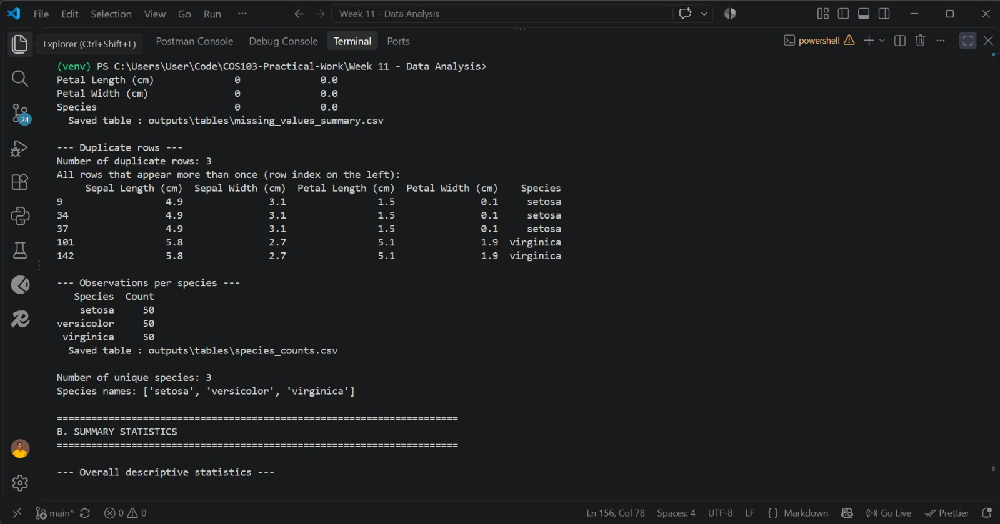

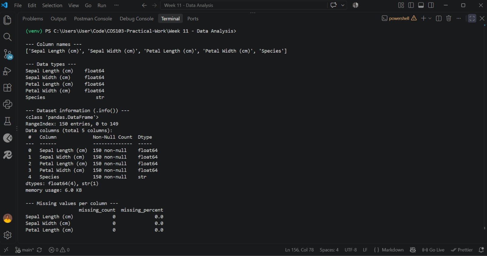

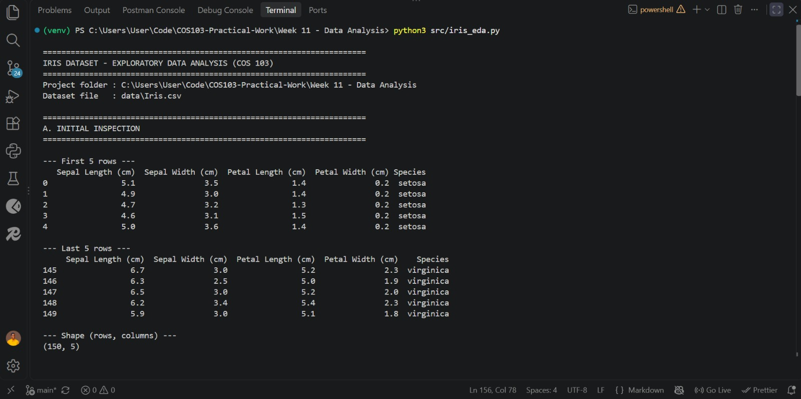

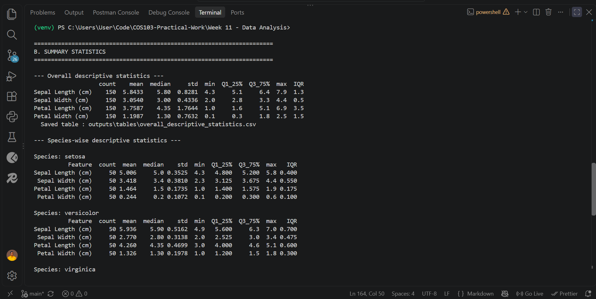

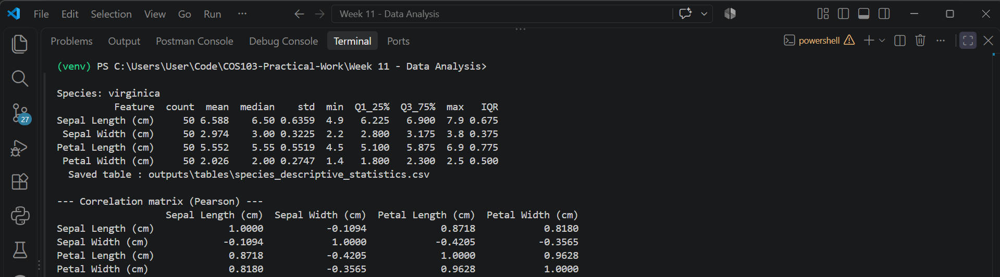


### 2. Species Distribution

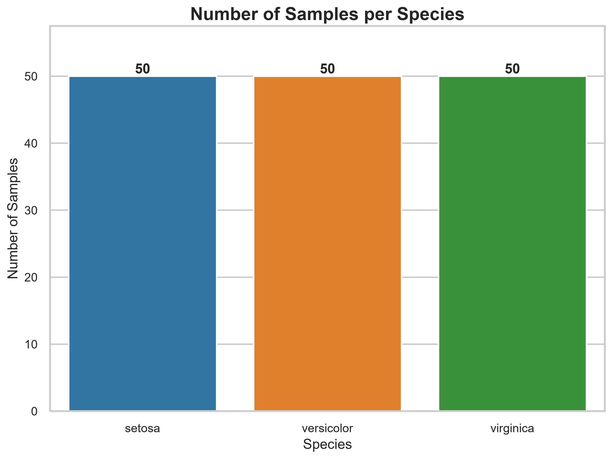

### 3. Feature Distributions

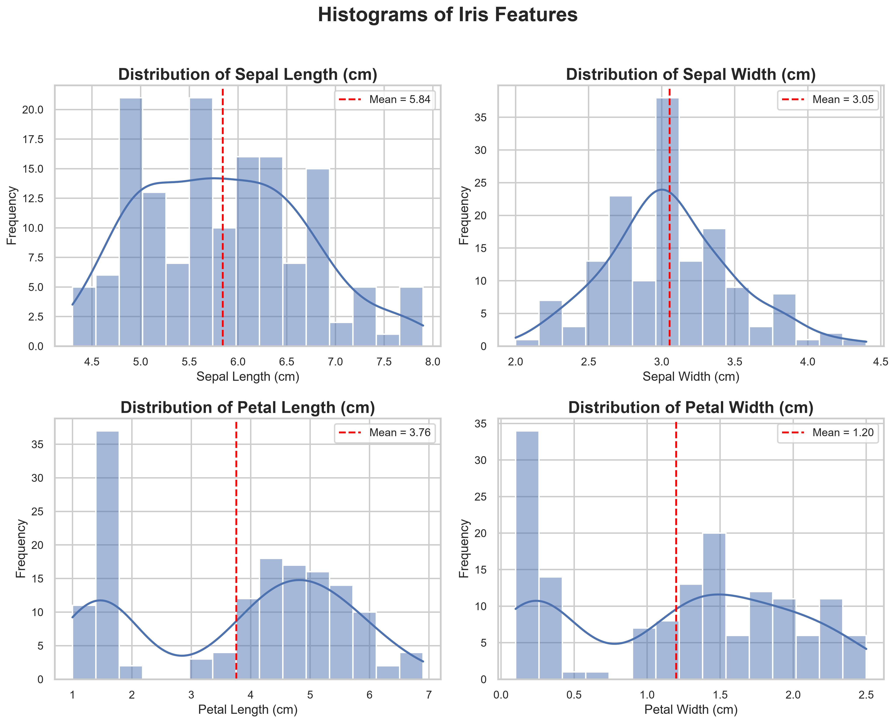

### 4. Feature Comparison by Species

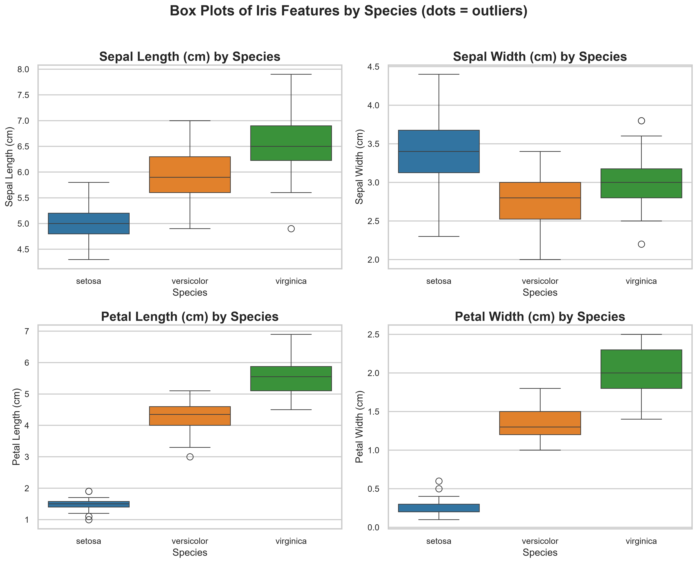

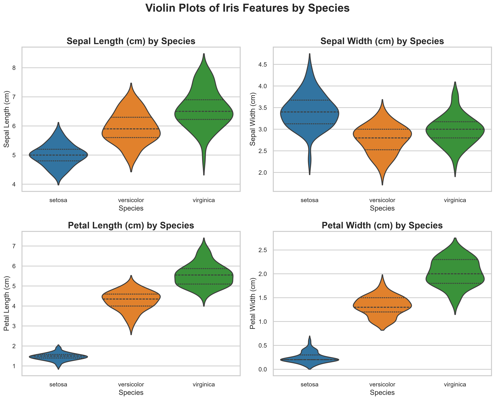

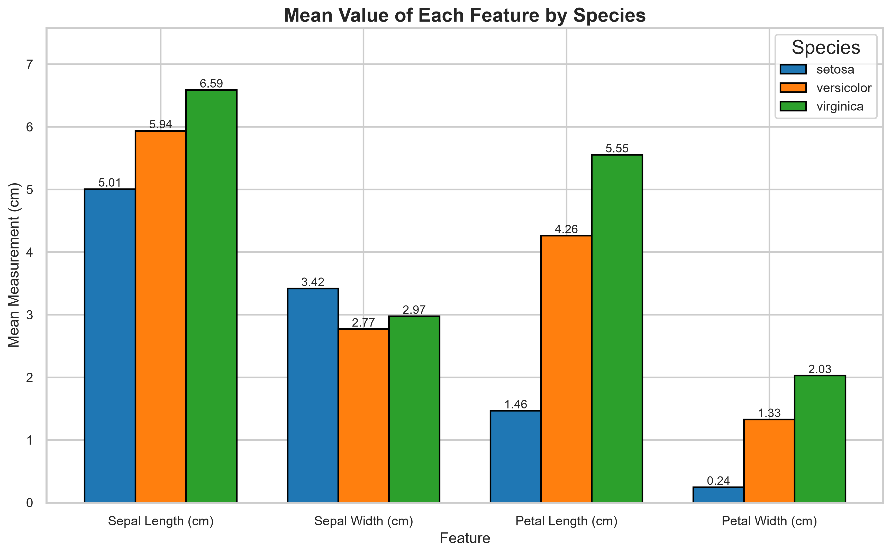

### 5. Relationships Between Features

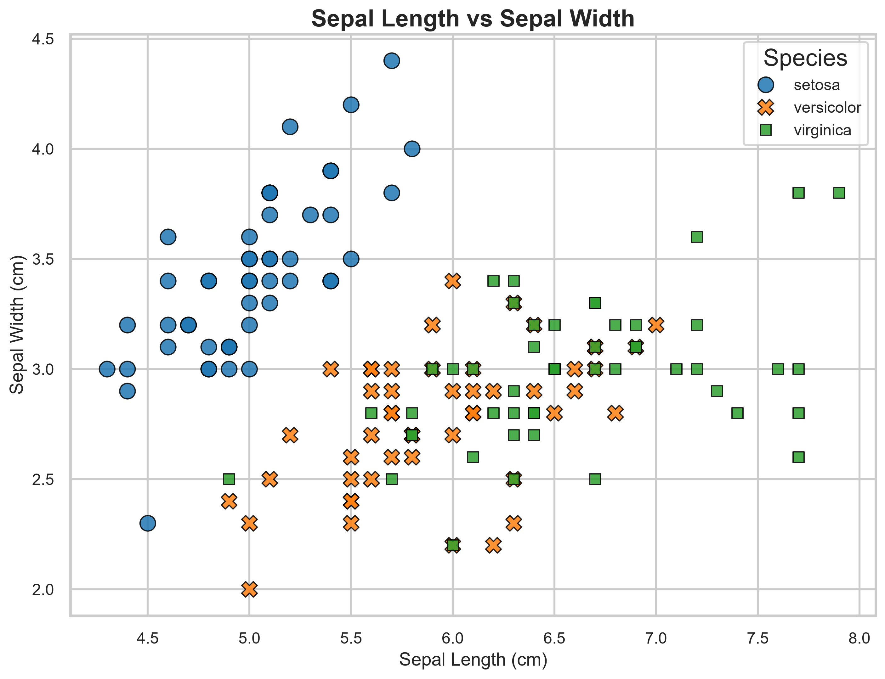

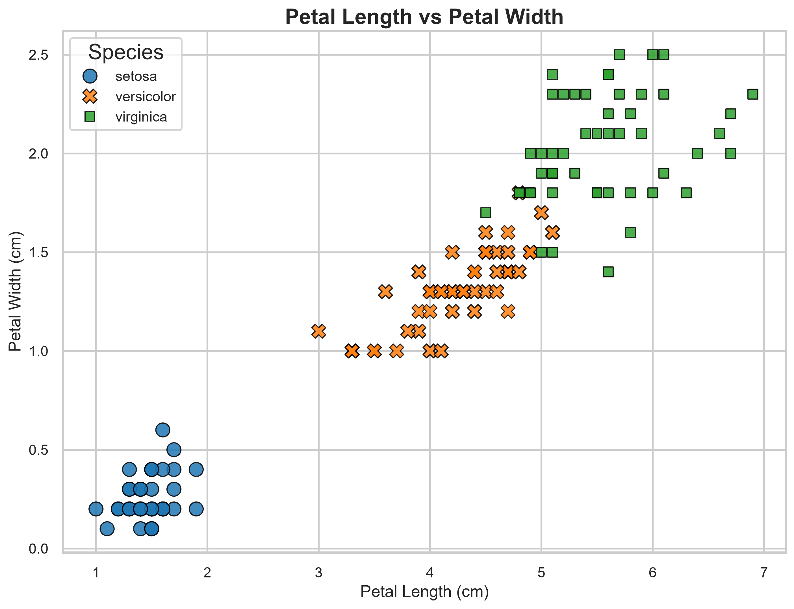

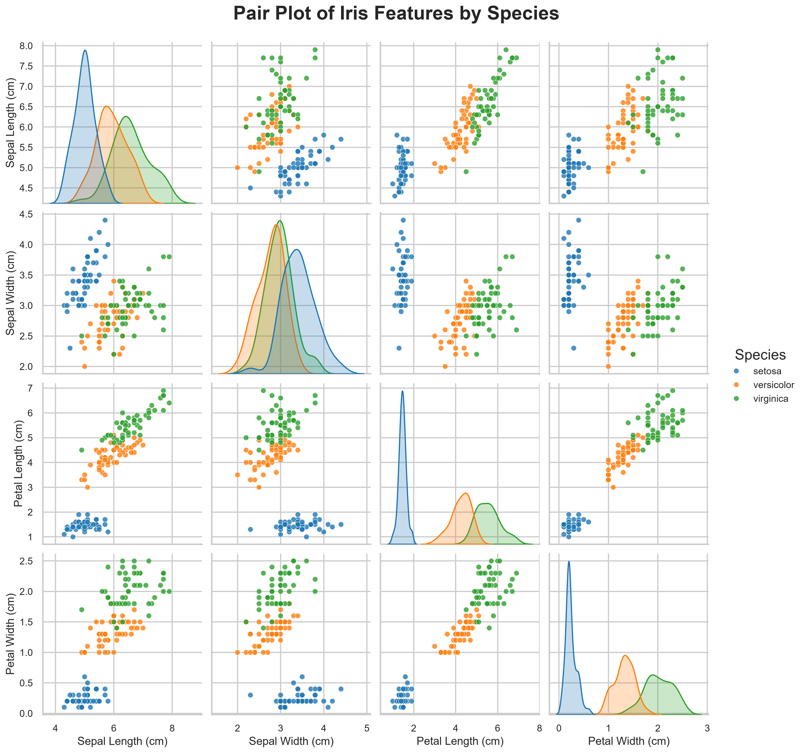

### 6. Feature Correlation

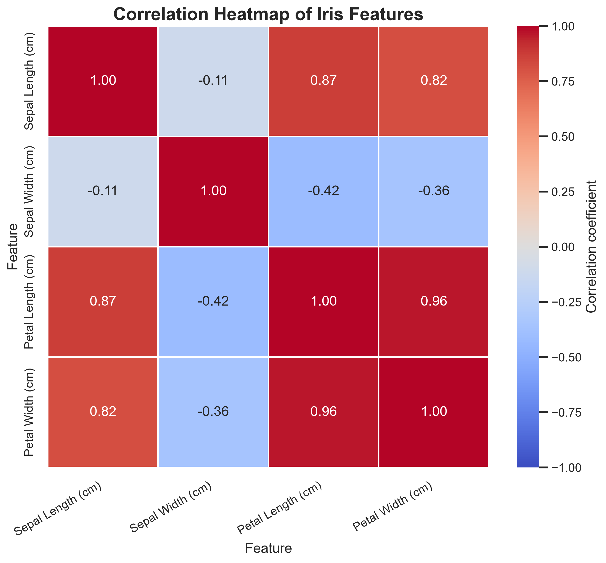

### 7. Generated Tables (optional)


## 18. License

This project is released under the **MIT License**. See the [LICENSE](LICENSE) file. Replace `Martin Olutade Fiyinfoluwa` in `LICENSE` with your name. The Iris dataset belongs to its original authors and repositories (see `data/README.md`).
